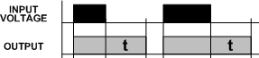

# Time delay relay simulator

You will create a time delay relay simulator.
You will use the blue user button(using external button worths extra point if it's connected to the D4 pin on the board)
- to adjust the delay time
- to simulate the input voltage applied to the relay.

A relay is an electrically operated switch.
Relays are used where it is necessary to control a circuit by a low-power signal, so you can turn on and off e.g. a 230V light bulb with a 5V microcontroller.
A time delay relay, is a traditional relay, but it is not only switching on and off, but you can adjust the time interval (t) to turn on the light for `t` seconds then at the end of `t` seconds, the output is de-energized, and the light turns off automatically.

Your task is to implement the so-called on/off delay mode of a time delay relay. 

#### Specification:
 - Your relay should have a pre-set default delay(t) which is 5 seconds: 
    - after you press, then release the blue user button as a simulated input voltage, an external LED(connected to D6 pin) should be turned on for 5 seconds.
	- in the energized state another button press has no effect
	- after 5 seconds, the LED turns off.
 - If you press the user button for more than 3 seconds, the program steps in to the configuration menu, where you can set the delay time:
	- the time delay is set by pressing the button as many times as many seconds delay you want.
	- to save this configuration and exit from the configuration menu you need to press the user button for more than 3 seconds again.
	- the minimum delay is 1 second and the maximum is 6. If the user pushes the button more than 6 times in the configuration menu the original delay remains.

 - You need to print several things to the serial monitor via UART:
    - If you press the user button for less then 3 seconds then print `LED is on for X seconds`. After X seconds elapsed print `LED is off`.
    - If you press the user button for more than 3 seconds in default state then print `Switched to configuration mode`.
    - If you press the user button for more than 3 seconds in configuration mode print `Switched to default state. The new delay is: X`.
    - If you press the button while the LED is turned on print `In energized state the button has no effect`.
    
NOTE(help): Don't forget about the immediate timer interrupt in case you re-initialize a timer.

#### Example:
 - In default state, if you press the button, then release, the LED is turned on for 5 seconds then turns off.
 - Then in default state, you press the button for 3125 ms so the program enters to configuration mode.
 - Then you press the button 3 times and none of them exceeds 3000 ms
 - Then you press the button for 4256 ms so the program enters to default state again.
 - Then you press and release the button and LED is turned on for 3 seconds then turns off.

#### Non-functional requirements:
 - You should use at least 1 timer peripheral
 - Try to avoid the use of blocking waiting mechanisms (like HAL_Delay())
 - Use external interrupt